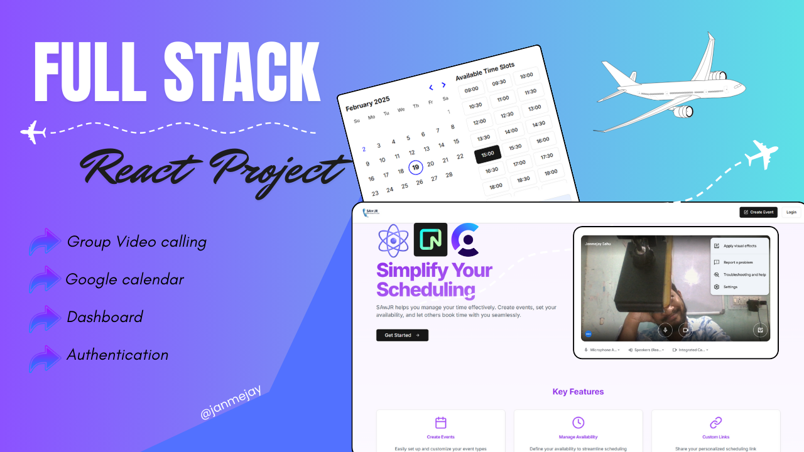

<h1 align="center">SAwJR (Smart Assistant with Joint Reminders)</h1>



## 📌 Description
SAwJR is a **smart scheduling app** designed for effortless meeting management, reminders, and collaboration. It ensures seamless planning and productivity, making it easy to schedule and manage meetings efficiently.

---

## 🚀 Installation

To install and set up the project, follow these steps:

1. Clone the repository:
   ```sh
   git clone https://github.com/JAnmejayVASahu/SAwJR.git
   cd SAwJR
   ```
2. Install dependencies:
   ```sh
   npm install @clerk/clerk-sdk-node @clerk/nextjs @hookform/resolvers @prisma/client @radix-ui/react-avatar @radix-ui/react-checkbox @radix-ui/react-dialog @radix-ui/react-icons @radix-ui/react-label @radix-ui/react-select @radix-ui/react-slot @radix-ui/react-tabs class-variance-authority clg clsx date-fns embla-carousel-autoplay embla-carousel-react googleapis lucide-react next pg react react-day-picker react-dom react-hook-form react-spinners tailwind-merge tailwindcss-animate vaul zod --save
   ```
3. Install development dependencies:
   ```sh
   npm install @eslint/eslintrc eslint eslint-config-next postcss prisma tailwindcss --save-dev
   ```
4. Start the development server:
   ```sh
   npm run dev
   ```

---

## 📂 Tech Stack
- **Frontend:** JavaScript, React, Tailwind CSS, ShadCN
- **Backend:** Next.js, Prisma, NeonDB
- **Authentication:** Clerk

---

## ⚡ Features
- ✅ **Meeting Scheduling** (Group & One-on-One)
- ✅ **Authentication** (User login & security)
- ✅ **Calendar Integration** (Planned feature)
- ✅ **Reminder Notifications** (Planned feature)

---

## 🔧 Usage
1. Run the development server:
   ```sh
   npm run dev
   ```
2. Open your browser and visit:
   ```
   http://localhost:3000
   ```

_(More details on usage will be updated soon)_

---

## 🛠️ Contributing
SAwJR is **open-source**, and contributions are welcome! To contribute:
1. Fork the repository.
2. Create a feature branch (`git checkout -b feature-branch-name`).
3. Commit your changes (`git commit -m "Added new feature"`).
4. Push to the branch (`git push origin feature-branch-name`).
5. Open a Pull Request.

---

## 📜 License
This project is licensed under the **MIT License**.

---

### 🎯 Future Updates
- 📌 Google Calendar Sync
- 📌 Dark Mode
- 📌 Email Notifications

---

🚀 *Stay productive with SAwJR!*

